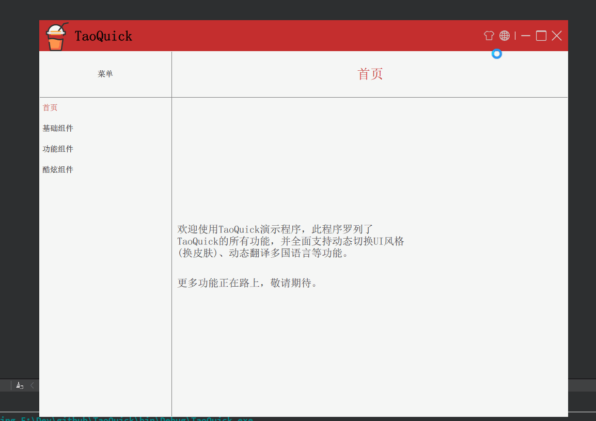

# TaoQuick

这是一个Qt/Qml组件库，集成了常用的QtQuick组件，并做了适当的属性封装、功能扩展，

以方便开发Qml程序，使Quick更Quick。

实现原理可以参考[博客](https://jaredtao.github.io) 或者 [知乎专栏](https://zhuanlan.zhihu.com/TaoQt)

《Qml组件化编程》系列文章。

## Build status
| [Ubuntu/MacOS][lin-link] | [Windows][win-link] |[License][license-link] | [Release][release-link]|[Download][download-link]|
| :---------------: | :-----------------: | :-----------------:|:-----------------: |:-----------------: |
| ![lin-badge]      | ![win-badge]        | ![license-badge] |![release-badge] | ![download-badge]|

[lin-badge]: https://travis-ci.com/jaredtao/TaoQuick.svg?branch=master "Travis build status"
[lin-link]: https://travis-ci.com/jaredtao/TaoQuick "Travis build status"
[win-badge]: https://ci.appveyor.com/api/projects/status/ontim37g33hvfv72?svg=true "AppVeyor build status"
[win-link]: https://ci.appveyor.com/project/jiawentao/TaoQuick "AppVeyor build status"
[release-link]: https://github.com/jaredtao/TableEdit/releases "Release status"
[release-badge]: https://img.shields.io/github/release/jaredtao/TaoQuick.svg?style=flat-square" "Release status"
[download-link]: https://github.com/jaredtao/TaoQuick/releases/latest "Download status"
[download-badge]: https://img.shields.io/github/downloads/jaredtao/TaoQuick/total.svg?style=flat-square "Download status"
[license-link]: https://github.com/jaredtao/TaoQuick/blob/master/LICENSE "LICENSE"
[license-badge]: https://img.shields.io/badge/license-MIT-blue.svg "MIT"

## 开发环境

* Qt 5.12.x

## 效果预览

### 启动界面

### 按钮控件

### 拖拽控件

### 自定义窗口

### 动态换皮肤

### 多国语言

### 渐变

### 进度条

## 代码结构

## 特别说明

项目包含插件加载机制，方便后续开发一些高级功能插件。

高级功能插件不开源，收取一定费用，需要的请联系我。

### 联系方式:

***

| 作者 | 涛哥                           |
| ---- | -------------------------------- |
|开发理念 | 弘扬鲁班文化，传承工匠精神 |
| QQ、TIM   | 759378563                      |
| 微信 | xsd2410421                       |
| 邮箱 | jared2020@163.com                |
| blog | https://jaredtao.github.io/ |

***

QQ(TIM)、微信二维码

###### 请放心联系我，乐于提供咨询服务，也可洽谈有偿技术支持相关事宜。

***
#### **打赏**

###### 觉得分享的内容还不错, 就请作者喝杯奶茶吧~~
***

