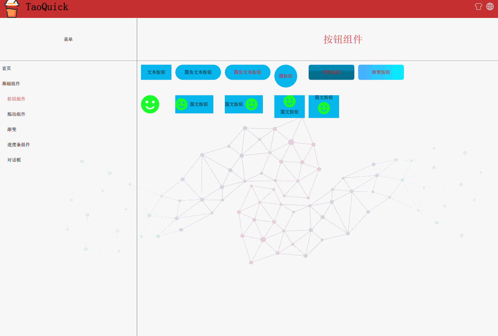
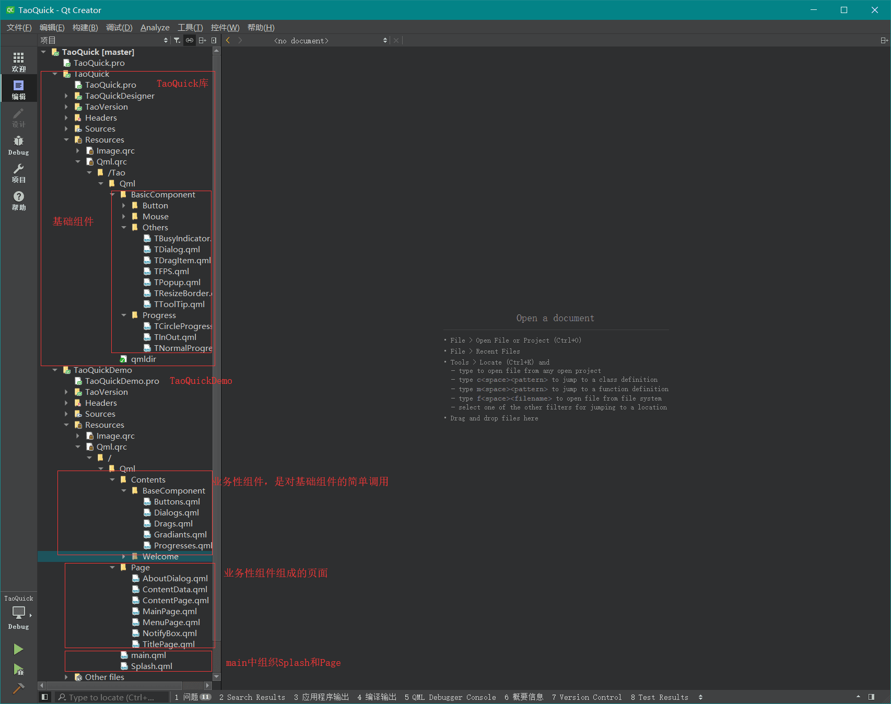
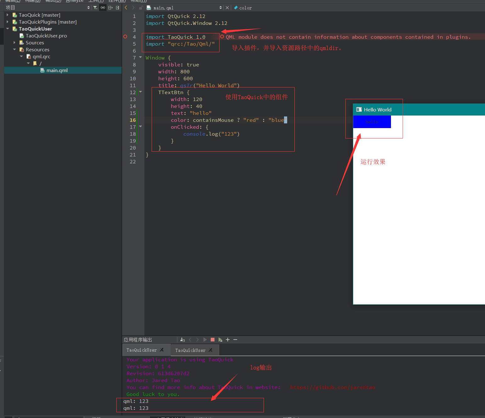

# TaoQuick

这是一个Qt/Qml组件库，集成了常用的QtQuick组件，并做了适当的属性封装、功能扩展，

以方便开发Qml程序，使Quick更Quick。

实现原理可以参考[博客](https://jaredtao.github.io) 或者 [知乎专栏](https://zhuanlan.zhihu.com/TaoQt)

《Qml组件化编程》系列文章。

## 徽章预览
### CI
|[License][license-link]| [Ubuntu/MacOS][lin-link] | [Windows][win-link] |[Release][release-link]|[Download][download-link]|latest|
|:--:|:--:|:--:|:--:|:--:|:--:|
|![license-badge]| ![lin-badge]| ![win-badge]|![release-badge] |![download-badge]|![download-latest]|

[license-link]: https://github.com/jaredtao/TaoQuick/blob/master/LICENSE "LICENSE"
[license-badge]: https://img.shields.io/badge/license-MIT-blue.svg "MIT"

[lin-badge]: https://travis-ci.com/jaredtao/TaoQuick.svg?branch=master "Travis build status"
[lin-link]: https://travis-ci.com/jaredtao/TaoQuick "Travis build status"
[win-badge]: https://ci.appveyor.com/api/projects/status/ontim37g33hvfv72?svg=true "AppVeyor build status"
[win-link]: https://ci.appveyor.com/project/jiawentao/TaoQuick "AppVeyor build status"

[release-link]: https://github.com/jaredtao/TaoQuick/releases "Release status"
[release-badge]: https://img.shields.io/github/release/jaredtao/TaoQuick.svg?style=flat-square "Release status"
[download-link]: https://github.com/jaredtao/TaoQuick/releases/latest "Download status"
[download-badge]: https://img.shields.io/github/downloads/jaredtao/TaoQuick/total.svg "Download status"
[download-latest]: https://img.shields.io/github/downloads/jaredtao/TaoQuick/latest/total.svg "latest status"

### Repo 
|latest tag|languages|top language|code size|repo size|
|:--: |:--: |:--:|:--:|:--:|
|![tag-latest]|![languanges]|![taolanguage]|![code-size]|![repo-size]|

[languanges]: https://img.shields.io/github/languages/count/jaredtao/taoquick.svg "language count"
[taolanguage]: https://img.shields.io/github/languages/top/jaredtao/taoquick.svg "top language"
[code-size]: https://img.shields.io/github/languages/code-size/jaredtao/taoquick.svg "code size"
[repo-size]: https://img.shields.io/github/repo-size/jaredtao/taoquick.svg "repo-size"
[tag-latest]: https://img.shields.io/github/tag/jaredtao/taoquick.svg

### Issue
|[Issues][issues-link]|closed issue|pull request|pull closed|
|:--:|:--:|:--:|:--:|
|![issuse-badge]|![issue-closed]|![pull-request]|![pull-closed]|

[issues-link]: https://github.com/jaredtao/TaoQuick/issues 
[issuse-badge]: https://img.shields.io/github/issues/jaredtao/taoquick.svg?style=popout 
[issue-closed]: https://img.shields.io/github/issues-closed/jaredtao/taoquick.svg
[pull-request]: https://img.shields.io/github/issues-pr/jaredtao/taoquick.svg
[pull-closed]: https://img.shields.io/github/issues-pr-closed/jaredtao/taoquick.svg

### Other status

|commit-active|laste commit|release date|forks|stars|goto hit|
|:--:|:--:|:--:|:--:|:--:|:--:|
|![commit-active]|![commit-latest]|![release-date]|![forks-badge]|![stars-badge]|![goto-hit]|

[forks-badge]: https://img.shields.io/github/forks/jaredtao/taoquick.svg "forks"
[stars-badge]: https://img.shields.io/github/stars/jaredtao/taoquick.svg "stars"
[goto-hit]: https://img.shields.io/github/search/jaredtao/taoquick/goto.svg "goto-hit"
[commit-active]: https://img.shields.io/github/commit-activity/w/jaredtao/taoquick.svg
[commit-latest]: https://img.shields.io/github/last-commit/jaredtao/taoquick.svg
[release-date]: https://img.shields.io/github/release-date/jaredtao/taoquick.svg

## 开发环境

* Qt 5.12.x

## 效果预览

### 启动界面


### 按钮控件



### 拖拽控件


### 自定义窗口


### 动态换皮肤


### 多国语言


### 渐变


### 进度条


## 代码结构



## TaoQuick 安装

App目录是TaoQuickDemo项目，示例如何使用TaoQuick库的。

Core目录是TaoQuick库，可以安装并在任意项目中使用。

### QtCreator安装TaoQuick

如下图所示:


任意编译器kit都可以，项目->构建步骤->添加build步骤->Make，添加之后在make参数中输入install。最后重新构建工程，即可完成安装。

TaoQuick.lib将被安装到{QTDIR}/qml/TaoQuick/TaoQuick.lib 路径下。

### 命令行安装TaoQuick

确保环境变量PATH中有QTDIR/bin，即能找到qmake

在TaoQuick目录，依次执行以下命令：

```
qmake
make
make install

```

## TaoQuick 使用

只要写上这两句，就完成了TaoQuick的导入
```
import TaoQuick 1.0
import "qrc:/Tao/Qml/"
```



`import TaoQuick 1.0` 是在导入dll库。
`import "qrc:/Tao/Qml/` 是在导入"qrc:/Tao/Qml/"路径下的qmldir文件。这个文件描述了TaoQuick中的所有组件。导入过后就能使用全部的组件了。

TaoQuick的Qml是以资源文件的方式编译进dll的，暂时不支持QtCreator的语法高亮。

## TaoQuick文档


## 特别说明

TaoQuickDemo包含插件加载机制，方便后续开发一些高级功能插件。

高级功能插件不开源，收取一定费用，需要的请联系我。


### 联系方式:

***

| 作者 | 涛哥                           |
| ---- | -------------------------------- |
|开发理念 | 弘扬鲁班文化，传承工匠精神 |
| QQ、TIM   | 759378563                      |
| 微信 | xsd2410421                       |
| 邮箱 | jared2020@163.com                |
| blog | https://jaredtao.github.io/ |

***

QQ(TIM)、微信二维码


###### 请放心联系我，乐于提供咨询服务，也可洽谈有偿技术支持相关事宜。

***
#### **打赏**


###### 觉得分享的内容还不错, 就请作者喝杯奶茶吧~~
***

